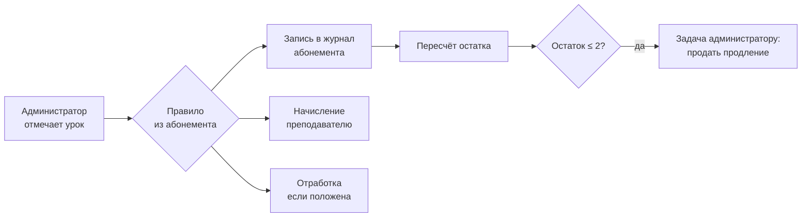

# RockCRM — функциональная спецификация v1

CRM для музыкальных школ. Мультитенантный SaaS: одна установка обслуживает
много школ, каждая видит только свои данные.

Первый клиент и источник требований — RockSchool Алматы: 2 филиала,
6 направлений, ~10 преподавателей, основа бизнеса — индивидуальные занятия
по абонементам.

Документ описывает **что** система делает и **по каким правилам**.
Схема БД — в [`../db/`](../db/), прототип интерфейса — в [`../prototype/`](../prototype/).

---

## 1. Границы

### Входит в v1

| Блок | Содержание |
|---|---|
| Расписание | Регулярные занятия, разовые, перенос, замена преподавателя, контроль конфликтов |
| Посещаемость | Отметка урока и её последствия |
| Абонементы | Продажа, списание, заморозка, отработки, продление |
| Деньги | Платежи, долги, выручка |
| Зарплаты | Начисление от проведённых занятий, ведомость |
| Заявки | Воронка от лида до покупки абонемента, пробные уроки |
| Кабинеты | Родителя, преподавателя, администратора |
| Уведомления | Напоминания о занятии и об оплате |

### Не входит в v1 — и почему

- **LMS** (видеоуроки, тесты, автопроверка). Другой продукт; офлайн-школе не нужен.
- **Онлайн-запись клиента в расписание.** В индивидуальном обучении слот
  подбирает администратор с учётом преподавателя, кабинета и уровня ученика.
  Самозапись ломает эту логику.
- **Бухгалтерия и налоги.** Отдаём в 1С/Учёт выгрузкой.
- **Мобильные приложения.** Кабинеты — адаптивный веб; нативные приложения
  только после подтверждённого спроса.
- **Управление концертами.** Есть в бэклоге, но это не то, из-за чего покупают.

---

## 2. Роли и права

| Роль | Видит | Может |
|---|---|---|
| **Владелец** | всё по своей школе | всё, включая правила, тарифы и ставки ЗП |
| **Администратор** | всё, кроме ставок ЗП других сотрудников | вести расписание, отмечать, продавать, принимать оплату |
| **Преподаватель** | своё расписание, своих учеников, свою ЗП | отмечать посещаемость своих занятий, писать заметки |
| **Родитель** | своих детей | видеть расписание и остаток, платить, просить перенос |
| **Ученик** (взрослый) | себя | то же, что родитель |

Права ограничены филиалом: администратор филиала Абая не правит расписание
Аль-Фараби. Владелец видит оба.

Отдельно: **суперадмин платформы** — обслуживает тенанты, не имеет доступа
к данным школ через обычный интерфейс.

---

## 3. Глоссарий

**Школа (tenant)** — клиент SaaS. Граница изоляции данных.

**Филиал** — физический адрес. У филиала свои кабинеты и расписание.

**Кабинет** — ресурс, который нельзя занять дважды. Имеет характеристики:
шумоизоляция, наличие установки, вместимость. Барабанное занятие нельзя
поставить в кабинет без установки.

**Направление** — барабаны, гитара, вокал и т.д. Определяет минимальный
возраст и допустимые форматы.

**Персона** — человек. Один человек может быть одновременно родителем
одного ученика и учеником сам. Поэтому персона отделена от ролей.

**Семья** — группа персон с общим плательщиком. Основа скидок за второго
ребёнка и единого счёта.

**Серия занятий** — правило «каждый вторник в 18:00 у Шарапова в Барабанной A».

**Занятие** — конкретный экземпляр серии или разовое занятие. Имеет статус,
посещаемость, заметки.

**Абонемент** — оплаченный пакет занятий с правилами и сроком действия.

**Отработка** — право провести занятие сверх абонемента, полученное взамен
корректно отменённого. Имеет свой срок жизни.

**Заморозка** — приостановка срока действия абонемента без потери занятий.

---

## 4. Ядро: жизненный цикл абонемента

Это то, ради чего строится система. Здесь ломаются все существующие решения.

### 4.1 Абонемент — журнал, а не счётчик

Остаток занятий **не хранится как изменяемое число**. Хранится журнал
операций, остаток — их сумма.

```
покупка          +8
занятие 4 авг    −1
отмена за 2 дня   0   (и +1 отработка)
прогул 5 авг     −1
занятие 7 авг    −1
                 ───
остаток           5
```

Почему так, а не `lessons_left = lessons_left - 1`:

- **Спор с родителем разрешается за 10 секунд.** «Куда делось занятие» —
  открываем журнал, видим дату, урок и кто отметил.
- **Отмена отметки обратима.** Администратор ошибся — пишем компенсирующую
  запись, а не правим число задним числом.
- **Ошибка в коде не разрушает данные.** Двойное списание видно в журнале
  как две записи, а не как «было 5, стало 3, почему — неизвестно».

Для скорости остаток дублируется в поле-кэш и пересчитывается триггером.
Кэш — оптимизация, источник правды — журнал; расхождение проверяется
регулярной сверкой.

### 4.2 Правила фиксируются на момент продажи

Правила списания хранятся **копией внутри абонемента**, а не ссылкой
на текущие настройки школы.

Если школа 1 сентября решит, что прогул больше не сгорает, это не должно
пересчитать июльские абонементы. Проданный абонемент — договор с клиентом
на условиях, действовавших в момент покупки.

Настраиваемые правила:

| Правило | Значения | По умолчанию |
|---|---|---|
| Прогул без предупреждения | сгорает / не сгорает | сгорает |
| Отмена заранее | порог в часах | 24 |
| Отмена заранее, последствие | в отработки / не списывается / сгорает | в отработки |
| Отменил преподаватель | в отработки / не списывается | не списывается |
| Срок жизни отработки | дней | 30 |
| Заморозка | максимум дней в год | 14 |
| Перенос абонемента | сколько занятий переходит на следующий период | 0 |

### 4.3 Отметка посещаемости — центральная операция

Одно действие администратора порождает три эффекта. Транзакция атомарна:
либо всё, либо ничего.



| Отметка | Абонемент | Отработка | ЗП преподавателю |
|---|---|---|---|
| Пришёл | −1 | — | 100% |
| Опоздал | −1 | — | 100% |
| Прогул без предупреждения | −1 | — | 100% |
| Отменил заранее (>24 ч) | 0 | +1 | 0% |
| Отменил преподаватель | 0 | +1 | 0% |

Проценты ЗП настраиваются: часть школ платит преподавателю за прогул
ученика, часть — нет.

**Интерфейс обязан показать последствия до подтверждения.** Администратор
видит «спишется 1 занятие, останется 4, начислится 4 500 ₸» и только потом
нажимает «Сохранить». Это снимает главный источник конфликтов с родителями.

### 4.4 Заморозка

Заморозка сдвигает `действует до` на число замороженных дней. Занятия
не сгорают. Ограничение — лимит дней в году, считается по календарному году.

Занятия, попавшие в интервал заморозки, отменяются без списания.

### 4.5 Отработки

Отработка — не «минус ещё одно занятие», а отдельная валюта с собственным
сроком. Провести отработку можно только в свободный слот преподавателя.
Просроченные отработки сгорают ночным заданием с записью в журнал.

---

## 5. Расписание

### 5.1 Серия и экземпляр

Регулярные занятия описываются серией (день недели, время, длительность,
период действия). Из серии материализуются конкретные занятия на 8 недель
вперёд, ночное задание достраивает горизонт.

Почему занятия материализуются, а не вычисляются на лету: у занятия есть
собственное состояние — посещаемость, заметки, перенос, замена
преподавателя, начисленная ЗП. К вычисляемому событию это не привязать.

Изменение одного занятия помечает его исключением и не трогает серию.
Изменение серии не переписывает уже проведённые занятия.

### 5.2 Конфликты ресурсов

Кабинет и преподаватель не могут быть заняты дважды в одно время.
Это **гарантируется базой данных**, а не проверкой в коде: параллельные
запросы двух администраторов не создадут двойную бронь.

Осознанный овербукинг возможен, но требует явного подтверждения
и остаётся видимым в интерфейсе как конфликт.

Дополнительно проверяется пригодность кабинета: барабанное занятие
требует кабинета с установкой и шумоизоляцией.

### 5.3 Перенос и замена

- **Перенос занятия** — смена времени экземпляра. Абонемент не затрагивается.
- **Замена преподавателя** — экземпляр получает другого преподавателя,
  ЗП начисляется фактическому.
- **Отмена занятия школой** — не списывает абонемент, порождает отработку.

---

## 6. Деньги

### 6.1 Платежи

Платёж привязан к семье и, как правило, к абонементу. Способы: Kaspi,
карта, наличные, перевод. Частичная оплата допускается — долг виден
в карточке и в сводке.

Интеграция с платёжными провайдерами Казахстана — отдельный документ;
в v1 фиксируется факт платежа, автосписание с карты приходит позже.

### 6.2 Зарплата преподавателей

Начисляется от факта проведённого занятия, а не от расписания. Ставка
зависит от формата (индивидуально/группа/пробный) и длительности (55/85 мин).
Возможна ставка процентом от стоимости занятия.

Начисления копятся в журнале, закрываются периодом (месяц). Закрытый
период не пересчитывается — правки идут корректировкой в следующем.

---

## 7. Заявки

Воронка: **новая → дозвон → пробный назначен → пробный проведён →
абонемент куплен**. Плюс отказ с обязательной причиной.

Заявки приходят из Telegram-бота, формы сайта, WhatsApp и вручную.
Источник фиксируется и участвует в отчёте о конверсии.

Пробный урок — полноценное занятие в расписании: занимает кабинет
и преподавателя, оплачивается разово, не списывается с абонемента.

Конверсия лида в ученика создаёт персону, семью и абонемент, сохраняя
связь с исходной заявкой.

---

## 8. Уведомления

| Событие | Кому | Канал | Когда |
|---|---|---|---|
| Напоминание о занятии | родителю | WhatsApp | за 24 ч |
| Занятие отменено школой | родителю | WhatsApp | сразу |
| Абонемент заканчивается | родителю + администратору | WhatsApp / задача | при остатке 2 |
| Долг по оплате | родителю | WhatsApp | на 3-й день |
| Отработка сгорает | родителю | WhatsApp | за 5 дней |
| Изменение расписания | преподавателю | Telegram | сразу |

Основной канал — WhatsApp: в Казахстане это фактический стандарт связи
школы с родителями. Telegram — для сотрудников.

---

## 9. Нефункциональные требования

**Изоляция тенантов.** Каждая строка принадлежит школе. Изоляция
обеспечивается политиками уровня строк в самой БД, а не условиями
в запросах приложения: забытый `WHERE tenant_id = ...` не должен приводить
к утечке данных другой школы.

**Аудит.** Операции, затрагивающие деньги и баланс — отметка, её отмена,
ручная корректировка, продажа, возврат — пишутся в неизменяемый журнал
с автором и временем.

**Персональные данные.** Система хранит ПДн несовершеннолетних граждан РК.
Требуется согласие на обработку при регистрации и, вероятно, размещение
базы на территории Казахстана — требование локализации нужно подтвердить
у юриста до продакшена.

**Часовой пояс.** Все моменты времени хранятся в UTC, отображаются
в часовом поясе филиала. Школа в Алматы и школа в Астане — разные пояса.

**Мягкое удаление.** Ученики, преподаватели и занятия не удаляются
физически: за ними стоят деньги и история.

---

## 10. Открытые вопросы к школе

1. Платят ли преподавателю при прогуле ученика? Заложено «да» — проверить.
2. Считается ли ЗП фиксированной ставкой или процентом от стоимости?
3. Нужен ли кабинет родителя или достаточно сообщений в WhatsApp?
4. Как сейчас обрабатывают отработки — есть ли вообще такая практика?
5. Кто отмечает посещаемость: администратор на ресепшене или преподаватель?
   От ответа зависит, что делать основным экраном.
